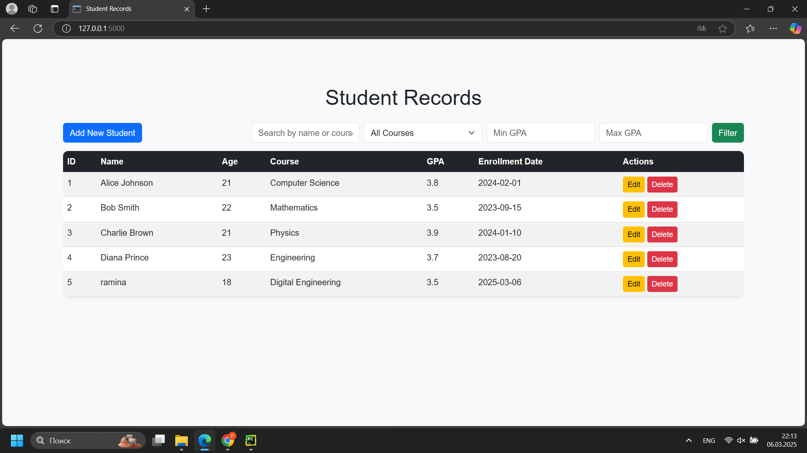

# Student Records Management System

## Description

This is a simple web application built with Flask and SQLAlchemy that allows users to manage student records. Users can add, edit, delete, search, and filter students based on name, course, and GPA.

## Features

- **CRUD Operations**: Create, Read, Update, and Delete student records.
- **Search Functionality**: Search students by name or course.
- **Filtering**: Filter students by course and GPA range.
- **Bootstrap UI**: A modern and responsive interface.

## Technologies Used

- Flask
- SQLAlchemy (SQLite Database)
- Bootstrap for styling
- JavaScript for live search

## Installation

1. **Clone the repository:**

   ```sh
   git clone https://github.com/ramigoii/student_records
   cd student-records
   ```

2. **Create a virtual environment (optional but recommended):**

   ```sh
   python -m venv venv
   source venv/bin/activate  # On Windows use `venv\Scripts\activate`
   ```

3. **Install dependencies:**

   ```sh
   pip install -r requirements.txt
   ```

4. **Initialize the database:**

   ```sh
   python populate_db.py
   ```

5. **Run the application:**

   ```sh
   flask run --debug
   ```

6. **Access the application:**
   Open your browser and go to `http://127.0.0.1:5000/`

## Usage

- Click on **Add New Student** to create a new student record.
- Use the **Search Bar** to find students by name or course.
- Use the **Filter options** to narrow results by course or GPA range.
- Click **Edit** to modify student details.
- Click **Delete** to remove a student record (confirmation required).

## Folder Structure

```
student_records/
│-- static/
│   ├── style.css
│-- instance/
│   ├── students.db
│-- templates/
│   ├── index.html
│   ├── add_student.html
│   ├── edit_student.html
│   ├── search.html
│-- app.py
│-- README.md
│-- populate_db.py
```

## Screenshot



## Future Enhancements

- Implement pagination for better user experience.
- Add user authentication.
- Export student data as CSV.

## License

This project is licensed under the MIT License.

